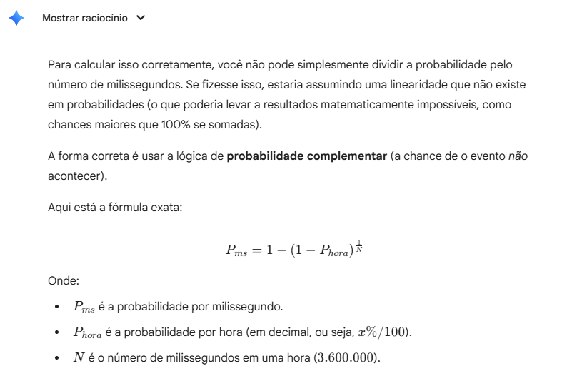
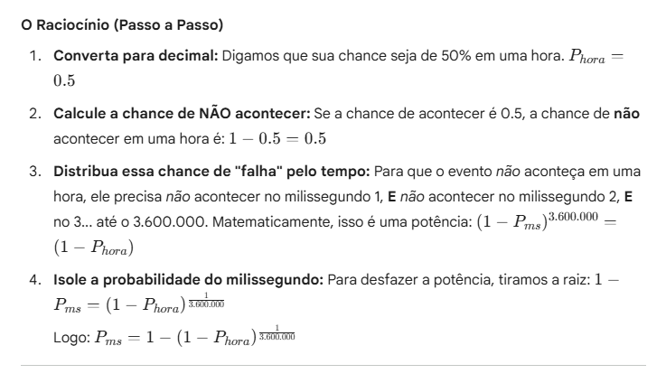
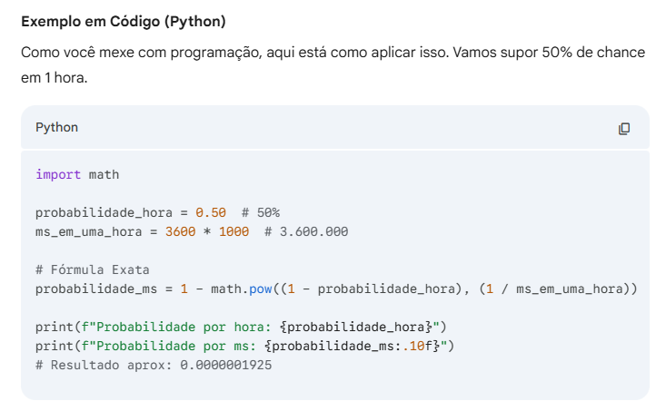

```py
    def auto_set_mean_value(self):
        # Calculate the size of the ranges
        normal_range = self.operating_range['normal'][1] - self.operating_range['normal'][0]

        if self.local_state == SensorStateEnum.NORMAL:
            # Change mean value to a random value inside the normal range
            self.mean_value = random.uniform(self.operating_range['normal'][0], self.operating_range['normal'][1])
        elif self.local_state == SensorStateEnum.DEGRADED:
            if self.old_state == SensorStateEnum.NORMAL:
                # Change mean value to a random value inside the degraded range but outside the normal range
                self.mean_value = random.uniform(self.operating_range['degraded'][0], self.operating_range['degraded'][1] - normal_range)
                if self.mean_value >= self.operating_range['normal'][0] and self.mean_value <= self.operating_range['normal'][1]:
                    self.mean_value += normal_range
            else:
                critical_to_left = self.mean_value < self.operating_range['normal'][0]
                if (critical_to_left):
                    # Change mean value to the left of the normal range
                    self.mean_value = random.uniform(self.operating_range['degraded'][0], self.operating_range['normal'][0])
                else:
                    # Change mean value to the right of the normal range
                    self.mean_value = random.uniform(self.operating_range['normal'][1], self.operating_range['degraded'][1])
        elif self.local_state == SensorStateEnum.CRITICAL:
            # Verify if the mean value is more to the left or to the right of the degraded range
            degraded_to_left = self.mean_value < self.operating_range['normal'][0]
            if (degraded_to_left):
                # Change mean value to the left of the degraded range
                self.mean_value = random.uniform(self.operating_range['critical'][0], self.operating_range['degraded'][0])
            else:
                # Change mean value to the right of the degraded range
                self.mean_value = random.uniform(self.operating_range['degraded'][1], self.operating_range['critical'][1])
        elif self.local_state == SensorStateEnum.FAILURE:
            # Verify if the mean value is more to the left or to the right of the critical range
            critical_to_left = self.mean_value < self.operating_range['normal'][0]
            if (critical_to_left):
                # Change mean value to the left of the critical range using a mirrored to left normal distribution with the mean value on the border of the critical range
                self.mean_value = random.normalvariate(self.operating_range['critical'][0], self.standard_deviation)
                if self.mean_value >= self.operating_range['critical'][0]:
                    self.mean_value = self.operating_range['critical'][0] + (self.operating_range['critical'][0] - self.mean_value)
            else:
                # Change mean value to the right of the critical range using a mirrored to right normal distribution with the mean value on the border of the critical range
                self.mean_value = random.normalvariate(self.operating_range['critical'][1], self.standard_deviation)
                if self.mean_value <= self.operating_range['critical'][1]:
                    self.mean_value = self.operating_range['critical'][1] - (self.mean_value - self.operating_range['critical'][1])
```

Essa função atualiza o valor médio do sensor, se o estado tiver ido pra NORMAL, ele seta um aleatório dentro do range normal, se tiver ido pra DEGRADED, ele verifica o estado anterior, se for NORMAL, ele seta um valor aleatório dentro do range DEGRADED mas fora do range NORMAL, se o estado anterior for CRITICAL, ele verifica se o valor médio atual está mais para a esquerda ou direita do range NORMAL e seta um valor aleatório para a esquerda ou direita no range DEGRADED, respectivamente. Se o estado for CRITICAL, ele verifica se o valor médio atual está mais para a esquerda ou direita do range DEGRADED e seta um valor aleatório para a esquerda ou direita do range DEGRADED, respectivamente. Se o estado for FAILURE, ele verifica se o valor médio atual está mais para a esquerda ou direita do range CRITICAL e seta um valor usando uma distribuição normal espelhada para a esquerda ou direita do range CRITICAL, respectivamente.

Essa função é chamada sempre que o estado do sensor muda, nos métodos:

```py
def update_state_by_probabilities(self)
# e
def upkeep(self)
```

---

O `UUID` foi substituído por um `int` incremental que fica salve em `globals.py` como `last_sensor_id`, toda vez que um sensor é criado, esse valor é incrementado. Essa variável é gerenciada na classe `Simulator`, nos métodos:

```py
def next_sensor_id(self) -> int:
        globals.last_sensor_id += 1
        return globals.last_sensor_id
# e
def reset(self) -> None:
        self.should_stop = False
        globals.time = 0
        globals.plant = ProductionPlant()
        globals.actuator = Actuator(globals.plant)
        globals.broker = Broker()
        globals.last_sensor_id = 0 # <- AQUI
        globals.is_running = False
        self.initialize_sensors(globals.plant, globals.broker)
```

---

Criação do método abaixo que calcula o impacto das mensagens de cada sensor para o atuador:

```py
    def compute_messages_impact(self, messages: list[tuple[int, int, dict]]) -> dict[int, float]:
        """
        Returns a dict with the keys as the
        sensors_ids and the values as the sum
        of impact of the messages
        """

        messages_impact: dict[int, float] = {}

        for inferred_role, _, data in messages:
            sensor = self.production_plant.get_sensor(data['sensor_id'])
            # Impact is calculated with the true role and the inferred role
            if (data['sensor_id'] not in messages_impact.keys()):
                messages_impact[data['sensor_id']] = 0
            messages_impact[data['sensor_id']] += ROLE_IMPACT[sensor.get_true_role()] * self.TRUE_ROLE_IMPACT_WEIGHT + ROLE_IMPACT[SensorRoleEnum(inferred_role)] * self.INFERRED_ROLE_IMPACT_WEIGHT

        self.last_messages_impact = messages_impact
        return messages_impact
```

essa função calcula o impacto das mensagens da seguinte forma:

- Um dict com chaves como os ids dos sensores e valores como a soma do impacto das mensagens é criado.
- Para cada mensagem na lista de mensagens recebidas pelo atuador, o dict é atualizado somando-se o impacto do cargo verdadeiro (true_role) do sensor com o impacto inferido pelo broker (inferred_role). Cada valor de impacto desse tem seu peso definido pelas constantes `TRUE_ROLE_IMPACT_WEIGHT` e `INFERRED_ROLE_IMPACT_WEIGHT`. Temos que ajustar isso futuramente para considerar a confiabilidade do broker e o quanto o actuator sabe do cargo real do sensor.
- O dict com o impacto das mensagens é retornado e salvo na variável de instância `last_messages_impact` do atuador.

---

Essa função do `actuator` serve para atualizar o estado dos sensores com base no impacto das mensagens recebidas e da carga de trabalho atual do atuador:

```py
    def update_sensors_states(self, all_messages: list[tuple[int, int, dict]]):
        """
        Updates the state of the sensors based on the messages received. The sensors to be updated are
        chosen based on the load term, which is a value between 0 and 1. The load term is calculated as
        the minimum between 1 and the THRESHOLD_LOAD divided by the load of the actuator. The sensors
        are ordered by their sum of impact in descending order, and the first load_term % sensors are
        chosen to be updated. If the sensor is not in the NORMAL state, its upkeep method is called.
        """

        # The load term is a value between 0 and 1
        # thats indicates how much % of the sensors
        # with positive sum of impact by messages will be upkept
        load_term = (min(1, self.THRESHOLD_LOAD / self.load)) # TODO: adjust

        sensors_sum_impact = self.compute_messages_impact(all_messages)
        sensors_sum_impact_ordered = sorted(sensors_sum_impact.items(), key=lambda item: item[1], reverse=True)

        # Get the first load_term % of the sensors
        sensors_to_analyze = sensors_sum_impact_ordered[:round(
            len(sensors_sum_impact_ordered) * load_term)]

        self.load_term = load_term
        self.sensors_sum_impact_ordered = sensors_sum_impact_ordered
        self.sensors_to_analyze = sensors_to_analyze

        if (globals.time % 3600000 == 0):
            print(f'{CYAN}Time: {globals.time / 60000} minutes, Load term: {load_term}, number of sensors to analyze: {len(sensors_to_analyze)} of {len(sensors_sum_impact)}{RESET}')
            print(
                f'{CYAN}Sensors to analyze:\n{"\n".join([f"    Sensor {sensor_id} ({self.production_plant.get_sensor(sensor_id).get_true_role()}), impact: {sum_impact}" for sensor_id, sum_impact in sensors_to_analyze])}{RESET}')

        for sensor_id, _ in sensors_to_analyze:
            sensor = self.production_plant.get_sensor(sensor_id)
            if (sensor.local_state != SensorStateEnum.NORMAL):
                sensor.upkeep()
                self.sp = True

        if (self.sp):
            print(
                f'{CYAN}Time: {globals.time / 60000} minutes, Load term: {load_term}, number of sensors analyzed: {len(sensors_to_analyze)} of {len(sensors_sum_impact)}{RESET}')
            print(
                f'{CYAN}Sensors analyzed:\n{"\n".join([f"    Sensor {sensor_id} ({self.production_plant.get_sensor(sensor_id).get_true_role()}), impact: {sum_impact}" for sensor_id, sum_impact in sensors_to_analyze])}{RESET}')
            self.sp = False
```

`load_term` é uma variável que indica a porcentagem de sensores com impacto positivo que serão manutenidos. Ela é calculada como a razão entre `THRESHOLD_LOAD` e a carga atual do atuador (`load`), limitada a 1. Desta forma, quanto maior a carga do atuador, menor será o `load_term`, e menos sensores serão manutenidos. Os sensores são ordenados com base no impacto total de suas mensagens, e os primeiros `load_term`% dos sensores são selecionados para análise. Se o estado do sensor não for NORMAL, o método `upkeep` do sensor é chamado para atualizar seu estado.
OBS: Da forma como está implementado, se a carga do atuador for suficientemente alta, nenhum sensor será manutenido. Temos que pensar se isso é o que queremos.

---

Adição de variáveis no `broker`:

```py
self.DROPPED_MESSAGES_BY_FULL_QUEUE = 0
self.ROUND_DROPPED_MESSAGES_COUNT = 0
self.ROUND_DROPPED_MESSAGES_BY_FULL_QUEUE = 0
```

todas elas são atualizadas no método `publish()`:

```py
def publish(self, sensor_id: int, data: dict[str, Any]) -> bool:
        if (sensor_id not in self.subscribers):
            print(f"{RED}Sensor not subscribed to broker.{RESET}")
            return False

        if len(self.queue) >= self.MAX_QUEUE_SIZE:
            self.DROPPED_MESSAGES_COUNT += 1
            self.DROPPED_MESSAGES_BY_FULL_QUEUE += 1 # <-- AQUI
            self.ROUND_DROPPED_MESSAGES_COUNT += 1 # <-- AQUI
            self.ROUND_DROPPED_MESSAGES_BY_FULL_QUEUE += 1 # <-- AQUI
            print(f"{YELLOW}Broker queue full. Dropping message.{RESET}")
            return False

        # TODO: infer sensor role by context instead of passing it randomly
        heapq.heappush(
            self.queue,
            (random.choice(list(SensorRoleEnum)).value, next(self._counter), data)
        )
        return True
```

que também teve uma mudança de ordem nos ifs, agora ele verifica se o sensor está inscrito antes de verificar se a fila está cheia, para evitar contar mensagens de sensores não inscritos como mensagens perdidas por fila cheia.

As variáveis `ROUND_DROPPED_MESSAGES_COUNT` e `ROUND_DROPPED_MESSAGES_BY_FULL_QUEUE` são zeradas no método `flush()` do broker, que é chamado sempre que o broker vai enviar as mensagens para o atuador:

```py
def flush(self) -> List[Tuple[int, int, dict[str, Any]]]:
        if (globals.time % 3600000 == 0):
            self.print_queue_stats()

        msgs = []
        while self.queue:
            msgs.append(heapq.heappop(self.queue))

        self.ROUND_DROPPED_MESSAGES_BY_FULL_QUEUE = 0 # <-- AQUI
        self.ROUND_DROPPED_MESSAGES_COUNT = 0 # <-- AQUI

        return msgs
```

---

Broker recebeu um novo método para visualizar as estatísticas da fila:

```py
def print_queue_stats(self):
        """
        Prints the percentage of each sensor role and sensor in the broker queue.

        Prints two tables: one with the percentage of messages of each sensor role in the broker queue
        and another with the percentage of messages of each sensor in the broker queue.

        :return: None
        """
        total_items = len(self.queue)

        if total_items == 0:
            print("Broker queue is empty.")
            return

        enum_counts = Counter(item[0] for item in self.queue)

        print(f"{BLUE}=== Percentage by Sensor Role in Broker Queue ==={RESET}")
        for enum_val, count in enum_counts.items():
            percentage = (count / total_items) * 100
            print(f"{BLUE}Role {SensorRoleEnum(enum_val)}: {percentage:.4f}%{RESET}")

        sensor_counts = Counter(item[2]['sensor_id'] for item in self.queue)

        print(f"{BLUE}=== Percentage by Sensor in Broker Queue ==={RESET}")
        for sensor_id, count in sensor_counts.items():
            percentage = (count / total_items) * 100
            print(f"{BLUE}Sensor '{sensor_id}': {percentage:.4f}%{RESET}")
```

este método imprime a porcentagem de mensagens de cada cargo de sensor e de cada sensor na fila do broker. Ele conta o número total de mensagens na fila e, em seguida, conta quantas mensagens existem para cada cargo de sensor e para cada sensor individualmente. A porcentagem é calculada dividindo o número de mensagens de cada cargo ou sensor pelo total de mensagens na fila, multiplicado por 100. As porcentagens são então impressas no console.

Este método é chamado no método `flush()` do broker a cada hora de simulação, para fornecer uma visão geral da distribuição das mensagens na fila do broker ao longo do tempo. (pode ser que esteja depreciado por conta do dashboard).

---

Criação das funções de conversão de probabilidade por tempo:

```py
def prob_hour_to_prob_ms(p_hour: float):
    """
    Converts a probability to something happening in a hour to a probability of the same thing happening in a millisecond.

    Parameters:
    p_hour (float): Probability per hour.

    Returns:
    float: Probability per millisecond.
    """

    return 1-math.pow(1-p_hour,1/3600000)

def prob_hour_to_prob_sec(p_hour: float):
    """
    Converts a probability to something happening in a hour to a probability of the same thing happening in a second.

    Parameters:
    p_hour (float): Probability per hour.

    Returns:
    float: Probability per second.
    """
    return 1-math.pow(1-p_hour, 1/3600)

def prob_hour_to_prob_min(p_hour: float):
    """
    Converts a probability to something happening in a hour to a probability of the same thing happening in a minute.

    Parameters:
    p_hour (float): Probability per hour.

    Returns:
    float: Probability per minute.
    """
    return 1-math.pow(1-p_hour, 1/60)
```

Essas funções foram criadss com o objetivo de converter uma probabilidade de um evento ocorrer em uma hora para a probabilidade do mesmo evento ocorrer em um milissegundo, segundo ou minuto. Isso é útil pois nossa simulação roda em milissegundos, mas muitas das probabilidades que queremos modelar são mais intuitivas de se pensar em termos de horas. As funções usam a fórmula de probabilidade de um evento ocorrer em uma hora para uma probabilidade do mesmo evento ocorrer em um milissegundo, segundo ou minuto, respectivamente, fórmula essa que foi extraída de uma conversa com o Google Gemini:





Essas funções são usadas no método `__initialize_transition_probabilities()` da classe `Sensor`, para inicializar as probabilidades de transição de estado dos sensores com base em probabilidades por hora:

```py
def __initialize_transition_probabilities(self):
        self.original_transition_probabilities = { # Values when the machine is normal
            SensorStateEnum.NORMAL: {
                SensorStateEnum.DEGRADED: random.uniform(prob_hour_to_prob_min(0.008), prob_hour_to_prob_min(.012)) # 0.8% to 1.2% per hour
                                                       # ^^^^^^^^^^^^^^^^^^^^^^^^^^^^  ^^^^^^^^^^^^^^^^^^^^^^^^^^^ AQUI
            },
            SensorStateEnum.DEGRADED: {
                SensorStateEnum.CRITICAL: random.uniform(prob_hour_to_prob_min(0.08), prob_hour_to_prob_min(0.16)), # 8% to 16% per hour
                                                       # ^^^^^^^^^^^^^^^^^^^^^^^^^^^  ^^^^^^^^^^^^^^^^^^^^^^^^^^^ AQUI
                SensorStateEnum.NORMAL: random.uniform(prob_hour_to_prob_min(0.001), prob_hour_to_prob_min(0.002)) # 0.1% to 0.2% per hour
                                                     # ^^^^^^^^^^^^^^^^^^^^^^^^^^^^  ^^^^^^^^^^^^^^^^^^^^^^^^^^^^ AQUI
            },
            SensorStateEnum.CRITICAL: {
                SensorStateEnum.FAILURE: random.uniform(prob_hour_to_prob_min(0.15), prob_hour_to_prob_min(0.4)), # 15% to 40% per hour
                                                      # ^^^^^^^^^^^^^^^^^^^^^^^^^^^  ^^^^^^^^^^^^^^^^^^^^^^^^^^ AQUI
                SensorStateEnum.DEGRADED: random.uniform(prob_hour_to_prob_min(0.001), prob_hour_to_prob_min(0.002)) # 1% to 2% per hour
                                                       # ^^^^^^^^^^^^^^^^^^^^^^^^^^^^  ^^^^^^^^^^^^^^^^^^^^^^^^^^^^ AQUI
            }
        }
        self.transition_probabilities = self.original_transition_probabilities
        print(f'Sensor {self.sensor_id} initialized with transition probabilities:')
        print(f'NORMAL->DEGRADED: {self.transition_probabilities[SensorStateEnum.NORMAL][SensorStateEnum.DEGRADED]}')
        print(f'DEGRADED->CRITICAL: {self.transition_probabilities[SensorStateEnum.DEGRADED][SensorStateEnum.CRITICAL]}')
        print(f'CRITICAL->FAILURE: {self.transition_probabilities[SensorStateEnum.CRITICAL][SensorStateEnum.FAILURE]}')
        print(f'CRITICAL->DEGRADED: {self.transition_probabilities[SensorStateEnum.CRITICAL][SensorStateEnum.DEGRADED]}')
        print(f'DEGRADED->NORMAL: {self.transition_probabilities[SensorStateEnum.DEGRADED][SensorStateEnum.NORMAL]}')
```

---

Salva o `old_state` de cada sensor sempre que o `local_state` é atualizado:

```py
def update_state_by_probabilities(self):
        """
        Updates the state of the sensor based on the transition probabilities.

        The method generates a random value between 0 and 1, and then iterates over the transition probabilities
        associated with the current state of the sensor. If the random value is less than the probability of a
        transition to a certain state, the sensor's state is updated to that state and the mean value is
        updated accordingly.

        If the sensor's state is updated, the method also sets the sp flag of the actuator to True and prints a
        message indicating the update.
        """
        rand_value = random.uniform(0, 1)

        possibly_states = self.transition_probabilities[self.local_state] if self.local_state != SensorStateEnum.FAILURE else {}

        prob_sum = 0

        for state, probability in possibly_states.items():
            if rand_value < probability + prob_sum and probability >= prob_sum:
                self.old_state = self.local_state # <- AQUI
                self.local_state = state
                self.auto_set_mean_value()
                self.last_update_by_prob = (globals.time, self.old_state, self.local_state)
                print(
                    f"{MAGENTA}Time: {globals.time / 60000} minutes, Sensor {self.sensor_id}({self.get_true_role()}) updated state from {self.old_state} to {self.local_state} and now has a mean value of {self.mean_value}{RESET}")
                globals.actuator.sp = True
                # print(f'NORMAL->DEGRADED: {self.transition_probabilities[SensorStateEnum.NORMAL][SensorStateEnum.DEGRADED]}')
                # print(f'DEGRADED->CRITICAL: {self.transition_probabilities[SensorStateEnum.DEGRADED][SensorStateEnum.CRITICAL]}')
                # print(f'DEGRADED->NORMAL: {self.transition_probabilities[SensorStateEnum.DEGRADED][SensorStateEnum.NORMAL]}')
                # print(f'CRITICAL->FAILURE: {self.transition_probabilities[SensorStateEnum.CRITICAL][SensorStateEnum.FAILURE]}')
                # print(f'CRITICAL->DEGRADED: {self.transition_probabilities[SensorStateEnum.CRITICAL][SensorStateEnum.DEGRADED]}')
                break
# e
def upkeep(self):
        """
        The upkeep method is called when the sensor is not in the NORMAL state.

        If the sensor is in the DEGRADED state, it is updated to the NORMAL state.

        If the sensor is in the CRITICAL state, it is updated to the DEGRADED state.

        The method prints a message indicating the update of the sensor's state.
        """
        self.old_state = self.local_state # <- AQUI
        if (self.local_state == SensorStateEnum.DEGRADED):
            self.local_state = SensorStateEnum.NORMAL
            print(f"{GREEN}Time: {globals.time / 60000} minutes, Sensor {self.sensor_id} ({self.get_true_role()}) upkept from DEGRADED to NORMAL{RESET}")
        elif (self.local_state == SensorStateEnum.CRITICAL):
            self.local_state = SensorStateEnum.DEGRADED
            print(
                f"{GREEN}Time: {globals.time / 60000} minutes, Sensor {self.sensor_id} ({self.get_true_role()}) upkept from from CRITICAL to DEGRADED{RESET}")
        self.auto_set_mean_value()
        self.last_upkeep = (globals.time, self.old_state, self.local_state)
```

---

O método `upkeep()` de cada sensor, agora atualiza o `local_state` e chama `auto_set_mean_value()` para ajustar o valor médio do sensor de acordo com o novo estado. Se o sensor estiver em estado `DEGRADED`, ele é atualizado para `NORMAL`. Se estiver em `CRITICAL`, ele é atualizado para `DEGRADED`. Após a atualização, uma variável estatística `last_upkeep` é registrada, contendo o tempo da última manutenção, o estado antigo e o novo estado do sensor.

```py
def upkeep(self):
        """
        The upkeep method is called when the sensor is not in the NORMAL state.

        If the sensor is in the DEGRADED state, it is updated to the NORMAL state.

        If the sensor is in the CRITICAL state, it is updated to the DEGRADED state.

        The method prints a message indicating the update of the sensor's state.
        """
        self.old_state = self.local_state # <- AQUI
        if (self.local_state == SensorStateEnum.DEGRADED):
            self.local_state = SensorStateEnum.NORMAL
            print(f"{GREEN}Time: {globals.time / 60000} minutes, Sensor {self.sensor_id} ({self.get_true_role()}) upkept from DEGRADED to NORMAL{RESET}")
        elif (self.local_state == SensorStateEnum.CRITICAL):
            self.local_state = SensorStateEnum.DEGRADED
            print(
                f"{GREEN}Time: {globals.time / 60000} minutes, Sensor {self.sensor_id} ({self.get_true_role()}) upkept from from CRITICAL to DEGRADED{RESET}")
        self.auto_set_mean_value()
        self.last_upkeep = (globals.time, self.old_state, self.local_state)
```

---

Agora a simulação é executada no método `run()` da classe `Simulator`, que substitui o antigo loop de simulação que estava no arquivo `main.py`:

```py
def run(self, steps: int = globals.DEFAULT_TIME_STEPS) -> None:
        globals.is_running = True
        for _ in range(steps):  # Time steps
            if self.should_stop:
                globals.is_running = False
                self.should_stop = False
                break
            for id, sensor in globals.plant.sensors.items():
                if (globals.time % 60000 == 0):
                    # Update the state of the sensor only every minute
                    # It turn the simulation faster
                    sensor.update_state_by_probabilities()
                # sensor.adjust_probabilities_by_time_passing() # It will degradate over time (by the use)

                # Sensor send data only if is it time to send
                current_sensor_message = sensor.send_data()

                if current_sensor_message is None:
                    continue

                globals.broker.publish(sensor.sensor_id, current_sensor_message)

            if (globals.time % 60000 == 0):  # Simulation actuator action only for each minute
                messages = globals.broker.flush()  # Broker has all messages collected by sensors in the last minute (the algorithm should be able to choose the messages to be saved in the queue)
                # this will need to modulate the transition probabilities for the messages to matter
                # to the environment
                globals.actuator.step(messages)
                if (globals.time % 3600000 == 0):
                    print(
                        f"Global State state: {globals.actuator.global_state[0]}, Global State load: {globals.actuator.global_state[1]}, Time: {globals.time / 60000} minutes\n")

            self.advance_time(1)  # 1 ms
            if (globals.time % 59999 == 0): time.sleep(0.00001)   # It enable api thread to respond
```

Atualizações nesse script fazem com que o método `sensor.update_state_by_probabilities()` seja chamado apenas a cada minuto de simulação, em vez de a cada milissegundo. Isso acelera a simulação, já que as mudanças de estado dos sensores não precisam ser avaliadas com tanta frequência. Além disso, o método `actuator.step(messages)` também é chamado apenas a cada minuto, permitindo que o atuador processe as mensagens do broker em intervalos mais longos e também tráz mais realismo às atuações do atuador que não são feitas instantaneamente (Pode se pensar em um tempo ainda maior para isso). Essas mudanças ajudam a reduzir a carga computacional da simulação, tornando-a mais eficiente sem comprometer significativamente a precisão dos resultados.

---

Criação do arquivo `globals.py` para armazenar variáveis globais da simulação:

```py
time: int
plant: 'ProductionPlant'
broker: 'Broker'
actuator: 'Actuator'
last_sensor_id = 0
is_running = False
DEFAULT_TIME_STEPS = 24 * 60 * 60 * 1000  # 24 hours
```

essas variáveis são setadas no método `reset()` da classe `Simulator`:

```py
self.should_stop = False
globals.time = 0
globals.plant = ProductionPlant()
globals.actuator = Actuator(globals.plant)
globals.broker = Broker()
globals.last_sensor_id = 0
globals.is_running = False
self.initialize_sensors(globals.plant, globals.broker)
```

e usadas por diversos componenentes da simulação.

---

Criação da API para coletar variáveis da simulação em tempo real, o código está em `api.py`:

```py
from fastapi import FastAPI
from typing import Union
from fastapi.middleware.cors import CORSMiddleware
import globals
from simulator import Simulator
import threading

app = FastAPI()

app.add_middleware(
    CORSMiddleware,
    allow_origins=["*"],
    allow_credentials=True,
    allow_methods=["*"],
    allow_headers=["*"],
)

@app.get("/")
def read_root():
    return {"Hello": "World"}

sim = Simulator.get_instance()

@app.get("/all")
def read_all():
    return {
        "time": globals.time,
        "actuator": read_actuator(),
        "broker": read_broker(),
        "plant": read_plant(),
        "sensors": read_sensors(),
    }

@app.get("/time")
def read_time():
    return {"time": globals.time}


@app.get("/actuator")
def read_actuator():
    return {
        "load": globals.actuator.load,
        "global_state": globals.actuator.global_state,
        "THRESHOLD_LOAD": globals.actuator.THRESHOLD_LOAD,
        "last_messages_impact": globals.actuator.get_last_messages_impact(),
        "last_load_term": globals.actuator.get_last_load_term(),
        "last_sensors_to_analyze": globals.actuator.get_last_sensors_to_analyze(),
        "last_sensors_sum_impact_ordered": globals.actuator.get_last_sensors_sum_impact_ordered(),
        "last_pondered_state": globals.actuator.get_pondered_state(),
    }


@app.get("/broker")
def read_broker():
    return {
        "subscribers": globals.broker.subscribers,
        "queue": globals.broker.queue,
        "MAX_QUEUE_SIZE": globals.broker.MAX_QUEUE_SIZE,
        "DROPPED_MESSAGES_COUNT": globals.broker.DROPPED_MESSAGES_COUNT,
        "DROPPED_MESSAGES_BY_FULL_QUEUE": globals.broker.DROPPED_MESSAGES_BY_FULL_QUEUE,
        "ROUND_DROPPED_MESSAGES_COUNT": globals.broker.ROUND_DROPPED_MESSAGES_COUNT,
        "ROUND_DROPPED_MESSAGES_BY_FULL_QUEUE": globals.broker.ROUND_DROPPED_MESSAGES_BY_FULL_QUEUE,
    }


@app.get("/plant")
def read_plant():
    return {
        "state": globals.plant.state,
        "sensors": globals.plant.get_sensors(),
    }


@app.get("/sensors")
def read_sensors():
    return [{
        "sensor_id": sensor.sensor_id,
        "sensor_type": (sensor.sensor_type.name, sensor.sensor_type.value),
        "role": (sensor.role.name, sensor.role.value),
        "operating_range": sensor.operating_range,
        "mean_value": sensor.mean_value,
        "sampling_interval": sensor.sampling_interval,
        "local_state": sensor.local_state,
        "standard_deviation": sensor.standard_deviation,
        "transition_probabilities": sensor.transition_probabilities,
        "last_update_by_prob": sensor.get_last_update_by_prob(),
        "last_upkeep": sensor.get_last_upkeep(),
        "last_thousand_values": sensor.get_last_thousand_values(),
        "last_value": sensor.get_last_value(),
        "last_message": sensor.get_last_message(),
        "old_state": sensor.get_old_state(),
    } for sensor in globals.plant.sensors.values()]

@app.post("/start")
def start(steps: int = globals.DEFAULT_TIME_STEPS):
    threading.Thread(target=sim.run,args=(steps,), daemon=True).start()


@app.post("/reset")
def reset():
    sim.stop()
    sim.reset()


@app.post("/stop")
def stop():
    sim.stop()
```

juntamente à API, diversos métodos `get_` foram adicionados às classes da simulação para facilitar a coleta de dados:

```py
    def get_last_update_by_prob(self):
        return self.last_update_by_prob

    def get_last_upkeep(self):
        return self.last_upkeep

    def get_old_state(self):
        return self.old_state

    # ...ENTRE OUTROS...
```

---

Criação de um `.gitignore`, um `README.md` e um `requirements.txt` para o projeto. Agora os pacotes utilizados são listados no `requirements.txt`, facilitando a instalação das dependências.

---

Criação da variável `last_thousand_values` na classe `Sensor`, que na verdade armazena os últimos 2000 valores lidos pelo sensor:

```py
def read_value(self):
        """
        Returns a random value from a normal distribution with mean
        self.mean_value and standard deviation self.standard_deviation.
        """
        self.last_value = random.normalvariate(
            self.mean_value, self.standard_deviation)  # Normal distribution
        self.last_thousand_values.append(self.last_value) # <- AQUI
        self.last_thousand_values = self.last_thousand_values[-2000:] # <- AQUI
        return self.last_value
```

---

Adicionei aleatoriedade ao `operating_range` e ao `mean_value` dos sensores na inicialização dos mesmos, no método `__initialize_sensor()` da classe `Simulator`:

```py
def __initialize_sensor(self):
    for _ in range(self.NUMBER_OF_SENSORS):
        normal_min = random.randint(50, 100)
        normal_max = random.randint(normal_min+1, 120)
        degraded = (random.randint(30, normal_min-1),
                    random.randint(normal_max+1, 140))
        critical = (random.randint(0, degraded[0]-1),
                    random.randint(degraded[1]+1, 170))
        sensor = Sensor(
            sensor_id=self.next_sensor_id(),
            # We will use the same sensor type to infer pragmatics with the same semantics
            sensor_type=SensorTypeEnum.TEMPERATURE,
            role=random.choice(list(SensorRoleEnum)),
            operating_range={  # TODO: Mocked and static values, change it
                "normal": (normal_min, normal_max),
                "degraded": degraded,
                "critical": critical
            },
            mean_value=random.uniform(normal_min, normal_max),  # This value should be in the normal range
            # Sensors that send data in a interval between 1 ms and 5 seconds
            sampling_interval=random.randint(1, 5000)
        )
        print(f'{CYAN}Sensor {sensor.sensor_id} initialized with role {sensor.role} and sampling interval {sensor.sampling_interval} ms{RESET}')
        plant.add_sensor(sensor)
        broker.subscribe(sensor)
```

Aqui a borda mínima do range NORMAL é um número aleatório entre 50 e 100, a borda máxima do range NORMAL é um número aleatório entre a borda mínima + 1 e 120. A borda mínima do range DEGRADED é um número aleatório entre 30 e a borda mínima do range NORMAL - 1, e a borda máxima do range DEGRADED é um número aleatório entre a borda máxima do range NORMAL + 1 e 140. A borda mínima do range CRITICAL é um número aleatório entre 0 e a borda mínima do range DEGRADED - 1, e a borda máxima do range CRITICAL é um número aleatório entre a borda máxima do range DEGRADED + 1 e 170. O valor médio inicial do sensor é um número aleatório dentro do range NORMAL.

---

Adicionado meios de iniciar e parar o simulador via API, com os endpoints `/start` e `/stop` no `api.py`:

```py
def stop(self) -> None:
    if globals.is_running: # <- AQUI
        self.should_stop = True # <- AQUI

def run(self, steps: int = globals.DEFAULT_TIME_STEPS) -> None:
    if globals.is_running: # <- AQUI
        return # <- AQUI
    globals.is_running = True # <- AQUI
    for _ in range(steps):
        if self.should_stop: # <- AQUI
            globals.is_running = False # <- AQUI
            self.should_stop = False # <- AQUI
            break # <- AQUI
        for id, sensor in globals.plant.sensors.items():
            if (globals.time % 60000 == 0):
                # Update the state of the sensor only every minute
                # It turn the simulation faster
                sensor.update_state_by_probabilities()
            # sensor.adjust_probabilities_by_time_passing() # It will degradate over time (by the use)

            # Sensor send data only if is it time to send
            current_sensor_message = sensor.send_data()

            if current_sensor_message is None:
                continue

            globals.broker.publish(sensor.sensor_id, current_sensor_message)

        if (globals.time % 60000 == 0):  # Simulation actuator action only for each minute
            messages = globals.broker.flush()  # Broker has all messages collected by sensors in the last minute (the algorithm should be able to choose the messages to be saved in the queue)
            # this will need to modulate the transition probabilities for the messages to matter
            # to the environment
            globals.actuator.step(messages)
            if (globals.time % 3600000 == 0):
                print(
                    f"Global State state: {globals.actuator.global_state[0]}, Global State load: {globals.actuator.global_state[1]}, Time: {globals.time / 60000} minutes\n")

        self.advance_time(1)  # 1 ms
        if (globals.time % 59999 == 0): time.sleep(0.00001)   # It enable api thread to respond

    globals.is_running = False # <- AQUI
```

---

Correção no método `update_global_state()` da classe `Actuator`, onde o cálculo do estado global foi ajustado para que cada estado tenha exatamente o mesmo comprimento de intervalo:

```py
def update_global_state(self):
        """
        Updates the global state of the production plant by calculating a weighted sum of the sensor states.

        The weighted sum is calculated by multiplying the value of each sensor state by the corresponding role weight,
        and then summing all the values together. The resulting sum is then divided by the sum of all the role weights,
        and the production plant state is set to the resulting value.

        Finally, the global state of the actuator is updated with the new production plant state and the current load.
        """
        sumTop = 0
        sumWeight = 0

        for sensor in list(self.production_plant.sensors.values()):
            sumTop += ROLE_WEIGHT[sensor.get_true_role()] * sensor.local_state.value
            sumWeight += ROLE_WEIGHT[sensor.get_true_role()]

        self.pondered_state = sumTop / sumWeight
        aux = self.pondered_state / 0.75
        self.production_plant.set_state(math.floor(aux))
        self.global_state = (self.production_plant.state, self.load)
```

Aqui, o cálculo do estado global foi ajustado para dividir o valor ponderado total dos estados dos sensores pelo somatório dos pesos dos cargos dos sensores. Isso garante que o estado global seja uma média ponderada correta dos estados dos sensores, refletindo com precisão a contribuição de cada sensor com base em seu cargo. Além disso, o cálculo do estado da planta de produção foi ajustado para garantir que cada estado tenha exatamente o mesmo comprimento de intervalo, dividindo o estado ponderado por 0.75 antes de arredondar para baixo. Assim, como são 4 estados (0, 1, 2, 3), cada estado cobre um intervalo de 0.75 na escala ponderada (0-0.75 para estado 0, 0.75-1.5 para estado 1, 1.5-2.25 para estado 2, e 2.25-3 para estado 3).

---

Correção do cálculo do desvio padrão na classe `Sensor`:

```py
def __init__(self,
                 sensor_id: int,
                 sensor_type: SensorTypeEnum,
                 role: SensorRoleEnum,  # The relevance of the sensor
                 operating_range: dict[Literal["normal", "degraded", "critical"], tuple[int, int]],
                 mean_value: float, # The mean value of the data generated by the sensor in the beginning
                 sampling_interval: int = 0, # 0 = every millisecond
                ):
        self.sensor_id = sensor_id
        self.sensor_type = sensor_type
        self.role = role
        self.operating_range = operating_range
        if (not self.__operating_range_is_ok()):
            raise Exception("Operating range is not valid")
        self.mean_value = mean_value
        self.standard_deviation = (operating_range['normal'][1] - operating_range['normal'][0]) / 4 # About 96% of the generated data will be inside the normal range
      # ^^^^^^^^^^^^^^^^^^^^^^^^^^^^^^^^^^^^^^^^^^^^^^^^^^^^^^^^^^^^^^^^^^^^^^^^^^^^^^^^^^^^^^^^^^^ AQUI
        self.local_state = SensorStateEnum.NORMAL
        self.sampling_interval = sampling_interval
        self.last_thousand_values: list[float] = []
        self.__initialize_transition_probabilities()
```

Aqui, o cálculo do desvio padrão foi corrigido para ser um quarto da largura do intervalo normal do sensor. Isso significa que aproximadamente 96% dos valores gerados pelo sensor estarão dentro do intervalo normal, o cálculo anterior, que dividia por 2 desconsiderada que o valor do desvio padrão é unilateral, ou seja, ele se aplica tanto para cima quanto para baixo em relação à média. Dividindo a largura do intervalo normal por 4, garantimos que a maioria dos valores gerados pelo sensor permaneça dentro do intervalo normal, refletindo com mais precisão o comportamento esperado do sensor em condições normais de operação.
